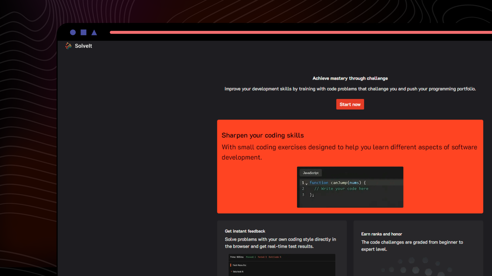

# Solve It

<div align="center">
  
</div>

### Overview

Solve It is a project that aims to recreate the functionality of LeetCode, a popular platform for practicing coding problems. Utilizing modern web development technologies such as React, Next.js, TypeScript, Tailwind CSS, and Firebase, this project provides users with an environment to solve coding problems, store their solutions, and engage with a community of fellow programmers.

## Features

- **Authentication**: Users can sign up, log in, and reset their passwords securely.
- **Problem Solving**: Access a collection of coding problems to solve.
- **Code Editor**: Utilize a code editor to write and test solutions.
- **Solution Storage**: Save and retrieve solutions for each problem.
- **Community Engagement**: Like, dislike, and star problems, as well as engage with other users' solutions.
- **Deployment**: Easily deploy the application using Vercel and Firebase.

## Demo

Check out the demo of the app [here](https://solve-it-js.vercel.app/).

## Table of Contents

- [Introduction](#solve-it)
- [Overview](#overview)
- [Features](#features)
- [Demo](#demo)
- [Setup](#setup)
- [Usage](#usage)
- [Deployment](#deployment)
- [Contributing](#contributing)
- [License](#license)

## Setup

Follow these steps to set up the Solve It project locally:

1. Clone the repository:

```bash
git clone https://github.com/TomasLaus/solve-it.git
```

2.Install dependencies:
```bash
cd solve-it
npm install
```

3. Set up Firebase:

Create a Firebase project and obtain your Firebase configuration.
Replace the Firebase configuration in the project's .env.local file.

4. Start the development server:
```bash
npm run dev

```

## Usage
Once the project is set up, you can access it locally at http://localhost:3000. Here's a brief overview of how to navigate and use the app:

- Authentication: Sign up or log in to access the problem-solving features.
- Problem Solving: Browse through available coding problems and select one to solve.
- Code Editor: Write your solution in the provided code editor and test it against the problem's test cases.
- Community Interaction: Engage with other users by liking, disliking, or starring problems and solutions.
- Settings: Customize your experience by accessing the settings modal.

## Contributing
Contributions to Solve It are welcome! Feel free to open issues or pull requests for any improvements or bug fixes.

## License
This project is licensed under the MIT License.